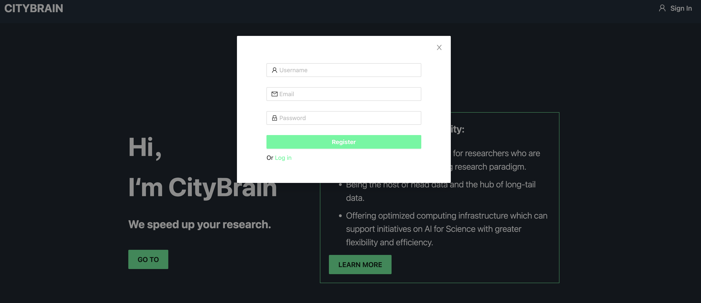
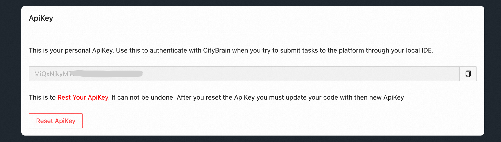

# How to access OSM+ dataset

1. **Installation.** First, you need to install citybrain-platform package:

```
pip install --upgrade citybrain-platform
```
2. **Platform Register.** Open http://221.228.10.51:18080 in browser and register:



3. **Get ApiKey.** Click the account name drop-down menu in the upper right corner, click ***Settings*** to enter the personal settings page, and you can view the ApiKey of the current account.



4. **Environment Setting.** Set the CITYBRAIN_APIKEY and BASEURL environment variable before using the library: 

```python
import citybrain_platform

citybrain_platform.api_key = "..."
citybrain_platform.api_baseurl = "http://221.228.10.51:18080/platform/" 
```

5. **Sample Code.**  Our OSM+ dataset is stored as tables, which include:
```
1. osm_node_roadnet
2. osm_fulltag_edge_roadnet
3. osm_split_edge_roadnet
```

you can access these tables using citybrain-platform API:
```python
import citybrain_platform
from citybrain_platform import JobStatus

# Create computing job
job_id = citybrain_platform.Computing.create_job(
  sql="select avg(col_id) from test_tblname;" # SQL commands 
)
print(job_id)

# View the job running status
job_status = citybrain_platform.Computing.get_job_status(
  job_id=job_id # 
)
print(job_status)

# Download result (csv format)
if (job_status.status == JobStatus.TERMINATED):
  citybrain_platform.Computing.get_job_results(
    job_id=job_id, 
    filepath="results.csv" # Save the result data to the local file path
  )
```

6. **More Information.** For more information about citybrain-platform API, see https://github.com/citybrain-platform/python-library
