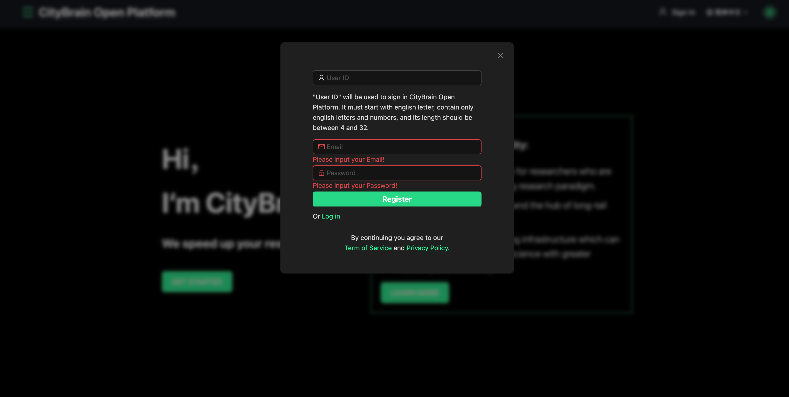
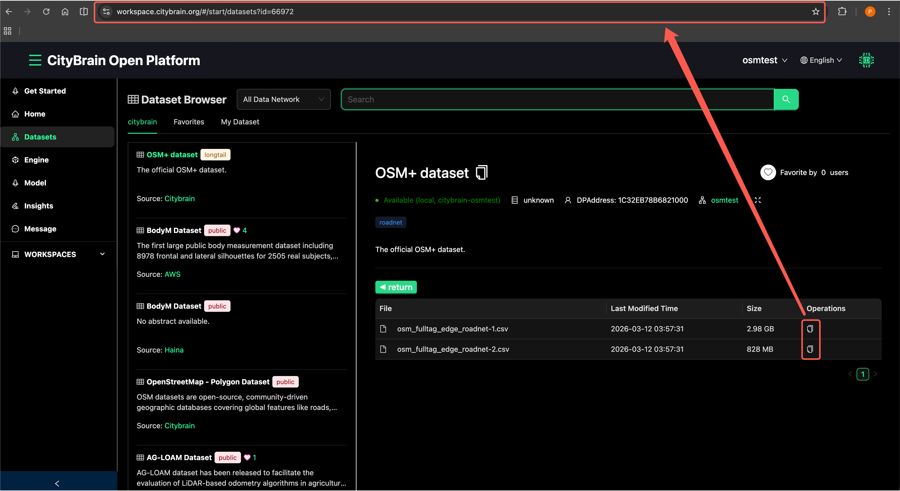
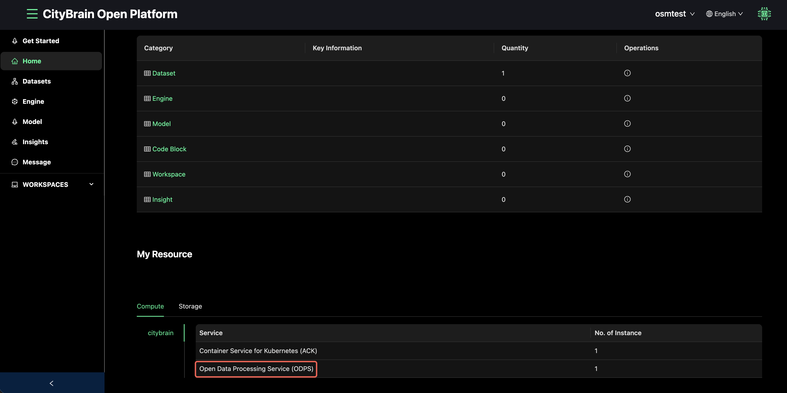
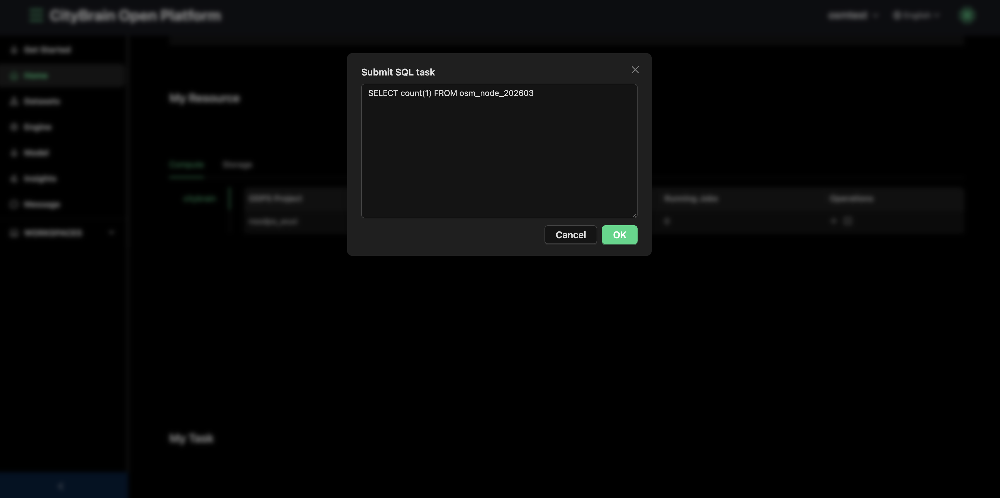
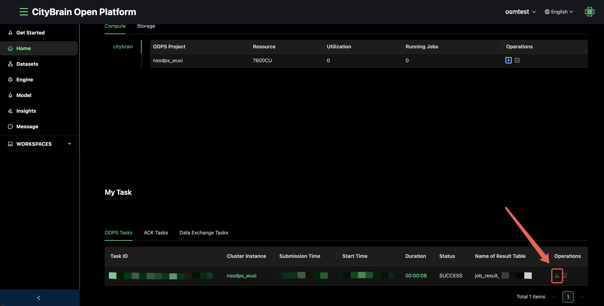

    
    
 

  <h1>OSM+: Billion-Level Open Street Map Dataset for City-wide Experiments</h1>

  <!-- 

      <a href="https://jhc.sjtu.edu.cn/~gjzheng/" target="_blank">Guanjie Zheng</a>1,
      <target="_blank">Ziyang Su</a>1,
      <target="_blank">Yuhang Luo</a>1,
      <target="_blank">Hongwei Zhang</a>2,
      
  

      <target="_blank">Yiheng Wang</a>1,
      <target="_blank">Linghe Kong</a>1,
      <target="_blank">Wen Ling</a>1
  

  

  1Shanghai Jiao Tong University, 2Alibaba Cloud Group
       
   

   
 -->

### :rocket: Quick Start for OSM+ dataset

1. **Platform Register.** First, user needs to register at Citybrain Open Platform. Open https://workspace.citybrain.org/#/home in browser and register.

2. **Get Dataset.** Open https://workspace.citybrain.org/#/start/datasets?id=66972 in browser, and then click in the folder, the detailed information of OSM+ dataset is shown.

3. **Download Dataset.** The OSM+ dataset contains three tables: *osm_node_roadnet*, *osm_split_edge_roadnet* and *osm_fulltag_edge_roadnet*. Click the "copy" button in the right, and then paste it into the search bar. The citybrain platform will automatically download the tables.

4. **Efficient Query Tools.** Users can perform efficient query operations on OSM+ based on the Citybrain Open Platform. Click *Open Data Processing Service (ODPS)* on the **Home** page.

5. **Input SQL Command.** Click the "+" button on the right to enter and execute the corresponding SQL commands on the platform.

6. **Get Results.** Finally, users can download results of SQL commands as csv files by clicking the download button of correspongding task.

